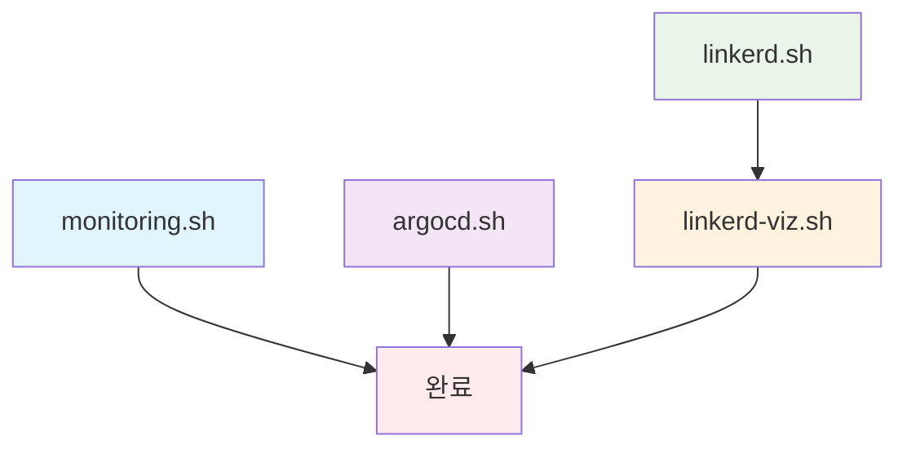

# Dev Environment Deployment Scripts

이 디렉토리는 원큐오더 개발 환경 배포를 위한 스크립트를 포함하고 있습니다.
이 스크립트들은 Kubernetes 클러스터에 모니터링, GitOps, 서비스 메시 및 관련 도구들을 배포하는 데 사용됩니다.

## 📁 스크립트 목록

| 스크립트              | 설명                                 | 주요 구성 요소              |
|-------------------|------------------------------------|-----------------------|
| `quick-deploy.sh` | **통합 배포 스크립트** - 모든 컴포넌트를 순차적으로 배포 | 전체 인프라 스택             |
| `monitoring.sh`   | 모니터링 스택 배포                         | Prometheus, Grafana   |
| `argocd.sh`       | GitOps 플랫폼 배포                      | ArgoCD                |
| `linkerd.sh`      | 서비스 메시 배포                          | Linkerd               |
| `linkerd-viz.sh`  | 서비스 메시 대시보드 배포                     | Linkerd Viz Dashboard |

## 🚀 빠른 시작

### 전체 인프라 한번에 배포 (권장)

```bash
# 모든 컴포넌트를 자동으로 순차 배포
./quick-deploy.sh
```

### 개별 컴포넌트 배포

```bash
# 1. 모니터링 스택 (Prometheus + Grafana)
./monitoring.sh

# 2. GitOps 플랫폼 (ArgoCD)
./argocd.sh

# 3. 서비스 메시 (Linkerd)
./linkerd.sh

# 4. 서비스 메시 대시보드 (Linkerd Viz)
./linkerd-viz.sh
```

## 📋 사전 요구사항

### 필수 도구

- **kubectl** - Kubernetes 클러스터 관리 도구
- **helm** - Kubernetes 패키지 매니저
- **step** - 인증서 생성 (Linkerd용)

### Kubernetes 클러스터

- 실행 중인 Kubernetes 클러스터
- LoadBalancer 서비스 지원 (AWS ELB 등)
- 충분한 리소스

## 🎯 배포 순서 및 의존성



**권장 배포 순서**:

1. `monitoring.sh` - 기본 모니터링 설정
2. `argocd.sh` - GitOps 플랫폼 구축
3. `linkerd.sh` - 서비스 메시 기반 구축
4. `linkerd-viz.sh` - 서비스 메시 모니터링

> 💡 **Tip**: `quick-deploy.sh`는 위 순서대로 자동 실행합니다.

## 🌐 접속 정보

배포 완료 후 다음 서비스들에 접근할 수 있습니다:

### Grafana (모니터링 대시보드)

```bash
# URL 확인
kubectl get svc prometheus-grafana -n monitoring -o jsonpath='{.status.loadBalancer.ingress[0].ip}'

# 접속 정보
# URL: http://<GRAFANA_IP>
# 사용자명: admin
# 비밀번호: kubectl get secret prometheus-grafana -n monitoring -o jsonpath="{.data.admin-password}" | base64 -d
```

### ArgoCD (GitOps 플랫폼)

```bash
# URL 확인
kubectl get svc argocd-server -n argocd -o jsonpath='{.status.loadBalancer.ingress[0].ip}'

# 접속 정보
# URL: https://<ARGOCD_IP>
# 사용자명: admin
# 비밀번호: kubectl get secret argocd-initial-admin-secret -n argocd -o jsonpath="{.data.password}" | base64 -d
```

### Linkerd Viz (서비스 메시 대시보드)

```bash
# URL 확인
kubectl get svc web -n linkerd-viz -o jsonpath='{.status.loadBalancer.ingress[0].ip}'

# 접속 정보
# URL: http://<LINKERD_VIZ_IP>:8084
# 인증: 없음 (Host 헤더 검증 해제됨)
```

## 🛠️ 유용한 명령어

### 전체 상태 확인

```bash
# 모든 네임스페이스의 Pod 상태
kubectl get pods --all-namespaces

# LoadBalancer 서비스 목록
kubectl get svc --all-namespaces --field-selector spec.type=LoadBalancer

# Helm 릴리스 목록
helm list --all-namespaces
```

### 개별 컴포넌트 상태 확인

```bash
# Monitoring 스택
kubectl get all -n monitoring

# ArgoCD
kubectl get all -n argocd

# Linkerd
kubectl get all -n linkerd
kubectl get all -n linkerd-viz

# 인증서 상태 (Linkerd)
kubectl get certificate -n linkerd
```

### 애플리케이션에 Linkerd 주입

```bash
# 특정 네임스페이스의 모든 Deployment에 Linkerd 주입
kubectl get deploy -n <your-namespace> -o yaml | linkerd inject - | kubectl apply -f -

# 특정 Deployment에만 주입
kubectl get deploy <deployment-name> -n <namespace> -o yaml | linkerd inject - | kubectl apply -f -
```

## 📚 참고 자료

- [Prometheus Operator](https://prometheus-operator.dev/)
- [ArgoCD Documentation](https://argo-cd.readthedocs.io/)
- [Linkerd Documentation](https://linkerd.io/2/overview/)
- [cert-manager Documentation](https://cert-manager.io/)
- [Step CLI Documentation](https://smallstep.com/docs/step-cli/)
